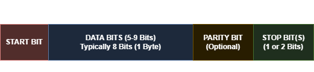

# UART-verilog
In the process of learning HDL for RTL design, came across some widely used pheripheral protocols like UART, SPI, I2C. So to get a deeper knowledge about the working procedure of communication procotols and to get hands on project experiance in RTL design, I started designing an UART module using Verilog. This repository helped me dive deep into the world of embedded systems, flow of data between modules inside IC, and the working principle of UART.

## UART Data Packet Format

**Example Frame:** 1 Start + 8 Data + 1 Parity + 1 Stop = 11 total bits 

